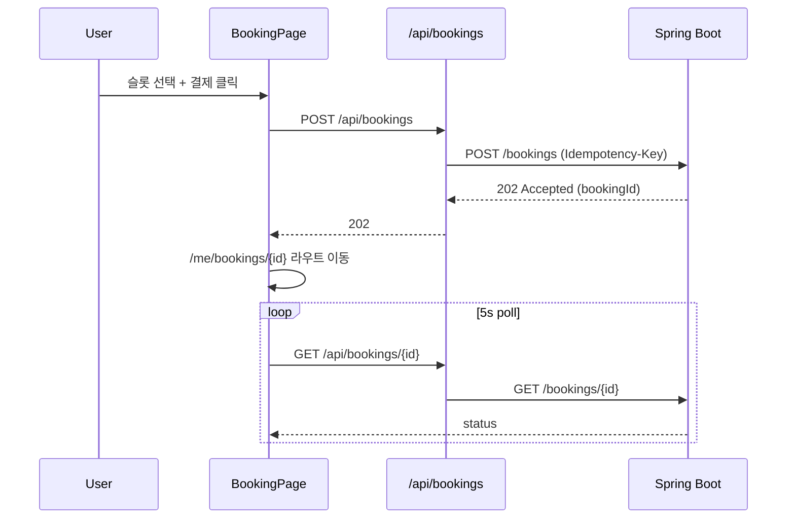
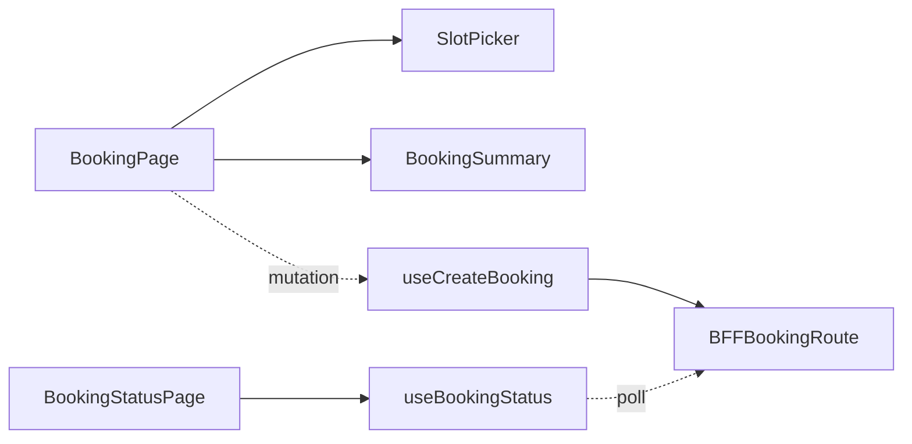

# [WEB-04] 시설 예매 화면 + 결제 흐름

## 작업 내용 (설계 의도)

### 변경 사항

`app/(authed)/facilities/[id]/book/page.tsx` 슬롯 선택 + 예약 신청. 슬롯 그리드 UI로 날짜·시간대 표시.

BFF:
- `GET /api/facilities/[id]/slots?date=...` 슬롯 목록 + 잔여 capacity
- `POST /api/bookings` 예약 신청 (BE 202 응답을 그대로 전달)
- `DELETE /api/bookings/[id]` 본인 예약 취소

예약 신청 직후 `/me/bookings/[id]` 상태 페이지로 이동. PENDING/CONFIRMED/CANCELLED 상태를 폴링(5초 간격) 또는 SSE로 갱신.

## 다이어그램

### 처리 흐름

### 클래스 의존

## 테스트 케이스

### 단위 테스트 (Unit)
| ID | 대상 | 케이스 |
|---|---|---|
| U-01 | `SlotPicker` | capacity=0 슬롯은 비활성 스타일로 렌더된다 |
| U-02 | `useCreateBooking` | Idempotency-Key UUID가 자동 생성되어 헤더로 전달된다 |
| U-03 | `BookingStatusBadge` | PENDING/CONFIRMED/CANCELLED 상태별 색상과 텍스트가 매핑된다 |

### 레포지토리 테스트 (Repository / Persistence)
| ID | 대상 | 케이스 |
|---|---|---|
| R-01 | — | 별도 Repository 없음 |

### 시나리오 테스트 (Scenario / Integration)
| ID | 시나리오 | 케이스 |
|---|---|---|
| S-01 | 예약 흐름 (Playwright) | 슬롯 선택 → 결제 → 상태 페이지에서 PENDING → 5초 내 CONFIRMED로 갱신된다 (BE mock) |
| S-02 | 실패 처리 | BE 409 응답(슬롯 충돌) 시 토스트 메시지로 사용자에게 알림 |
| S-03 | 멱등 키 | 동일 요청 두 번 전송 시 두 번째는 동일 bookingId를 받아 중복 결제가 없다 |
