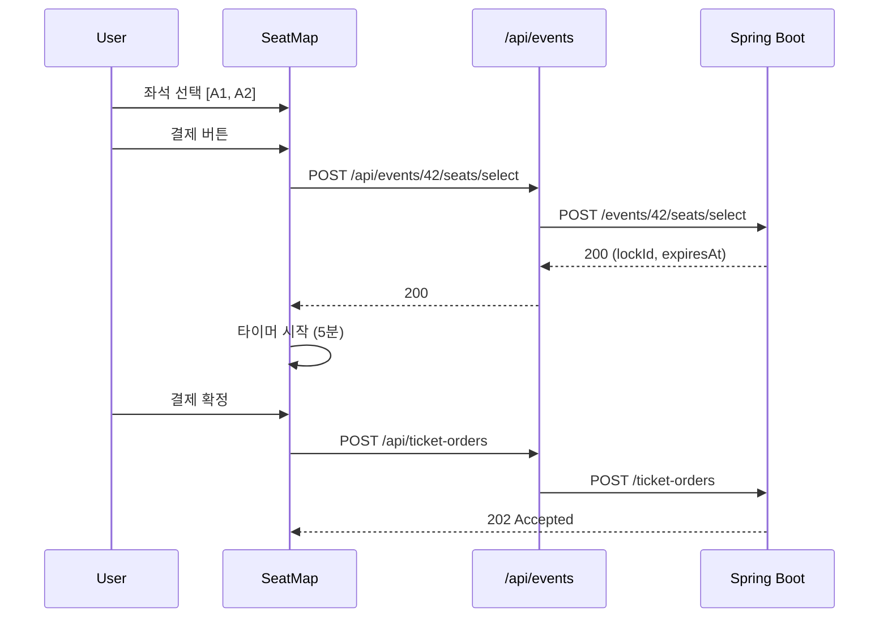
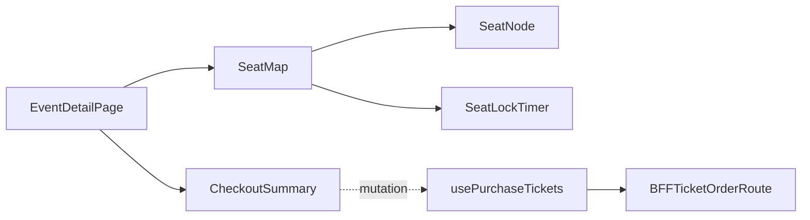

# [WEB-05] 경기 목록·좌석맵·티켓 구매 화면

## 작업 내용 (설계 의도)

### 변경 사항

`app/(public)/events/page.tsx` 경기 목록. `app/(public)/events/[id]/page.tsx` 단건 + 좌석맵.

좌석맵 컴포넌트는 SVG 기반. section/row/seat 좌표 데이터는 응답에 포함. 사용자가 좌석 클릭 → 클라이언트에서 선택 set 관리 → "결제" 버튼으로 BFF 호출.

BFF:
- `GET /api/events`, `GET /api/events/[id]`
- `POST /api/events/[id]/seats/select` (Idempotency-Key 포함)
- `POST /api/ticket-orders` 구매 확정

좌석 락 만료 5분 타이머를 화면에 표시. 만료 직전 30초 시점에 경고 토스트.

## 다이어그램

### 처리 흐름

### 클래스 의존

## 테스트 케이스

### 단위 테스트 (Unit)
| ID | 대상 | 케이스 |
|---|---|---|
| U-01 | `SeatMap` | 이미 발권된 좌석은 disabled, 락이 잡힌 좌석은 다른 사용자 보유 상태로 렌더된다 |
| U-02 | `SeatLockTimer` | 5분 타이머가 1초 단위로 갱신되고 30초 이하일 때 경고 색상으로 변경된다 |
| U-03 | `useSelectSeats` | BE 409 응답 시 선택 set을 비우고 토스트로 알림한다 |

### 레포지토리 테스트 (Repository / Persistence)
| ID | 대상 | 케이스 |
|---|---|---|
| R-01 | — | 별도 Repository 없음 |

### 시나리오 테스트 (Scenario / Integration)
| ID | 시나리오 | 케이스 |
|---|---|---|
| S-01 | 좌석 선택 → 구매 흐름 (Playwright) | 좌석 클릭 → lockId 획득 → 결제 클릭 → 202 응답 수신 |
| S-02 | 락 만료 처리 | 5분 경과 후 결제 시도 시 BE 409 응답이 토스트로 노출되고 좌석 선택이 초기화된다 |
| S-03 | 동시 사용자 | 두 브라우저가 동일 좌석 선택 시 한쪽은 success, 한쪽은 409 응답을 받는다 (BE mock) |
