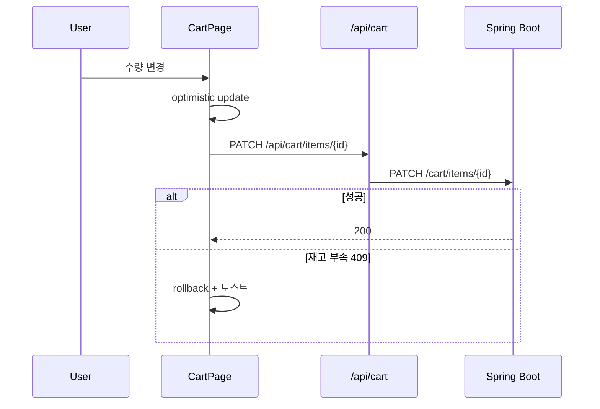
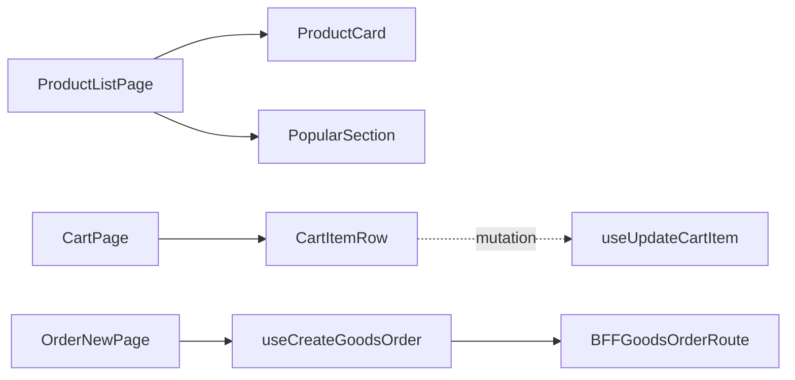

# [WEB-06] 상품 목록·장바구니·주문 화면

## 작업 내용 (설계 의도)

### 변경 사항

`app/(public)/products/page.tsx` 검색 + 인기 상품 섹션. `[id]/page.tsx` 단건. `(authed)/cart/page.tsx` 장바구니. `(authed)/orders/new/page.tsx` 주문 생성.

BFF:
- `GET /api/products`, `GET /api/products/popular`, `GET /api/products/[id]`
- `GET /api/cart/me`, `POST /api/cart/items`, `PATCH /api/cart/items/[id]`, `DELETE /api/cart/items/[id]`
- `POST /api/goods-orders`

장바구니 UI는 옵티미스틱 업데이트 + TanStack Query rollback 패턴. 결제 진행은 Booking 흐름과 동일하게 202 + 폴링.

## 다이어그램

### 처리 흐름

### 클래스 의존

## 테스트 케이스

### 단위 테스트 (Unit)
| ID | 대상 | 케이스 |
|---|---|---|
| U-01 | `useUpdateCartItem` | optimistic update 후 BE 실패 응답 시 이전 상태로 rollback된다 |
| U-02 | `CartItemRow` | quantity가 stockQuantity를 초과하면 +버튼이 disabled된다 |
| U-03 | `useCreateGoodsOrder` | 빈 장바구니 상태에서는 mutation을 호출하지 않고 가드한다 |

### 레포지토리 테스트 (Repository / Persistence)
| ID | 대상 | 케이스 |
|---|---|---|
| R-01 | — | 별도 Repository 없음 |

### 시나리오 테스트 (Scenario / Integration)
| ID | 시나리오 | 케이스 |
|---|---|---|
| S-01 | 장바구니 → 주문 흐름 (Playwright) | 상품 담기 → 장바구니 수량 변경 → 주문 → 202 응답 흐름이 동작한다 |
| S-02 | 재고 충돌 rollback | BE 409 응답 시 UI가 즉시 이전 수량으로 되돌아간다 |
| S-03 | 인기 상품 캐시 | 두 번째 방문은 BFF 캐시 헤더(s-maxage=60)로 빠른 응답을 받는다 |
