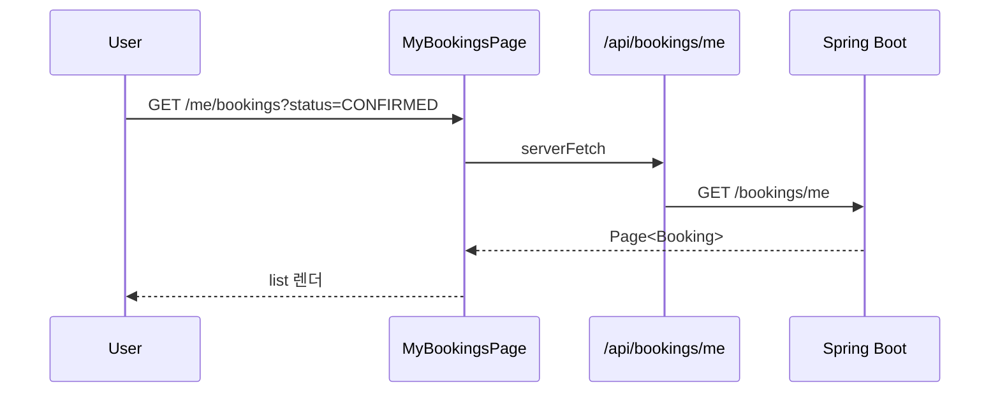
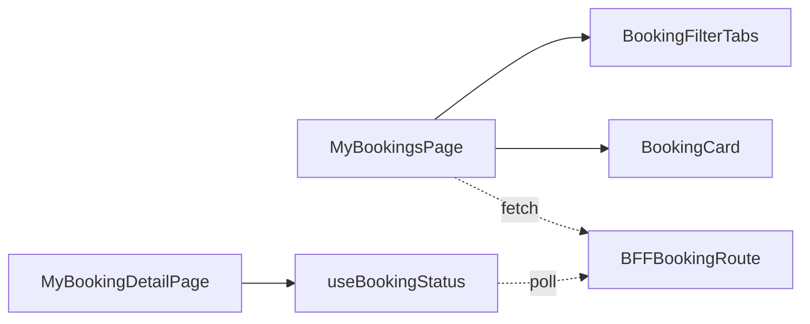

# [WEB-07a] 마이페이지 — 예약 목록

## 작업 내용 (설계 의도)

### 변경 사항

`app/(authed)/me/bookings/page.tsx`. 본인 예약(Booking) 목록 + 단건 상세 라우트. 상태 필터(PENDING/CONFIRMED/CANCELLED) + 페이지네이션. 단건 상세는 결제 상태 합산.

BFF: `GET /api/bookings/me`, `GET /api/bookings/[id]`, `DELETE /api/bookings/[id]`.

CONFIRMED 예약은 시설명·일시·결제 금액 카드로 표시. PENDING은 5초 폴링으로 상태 자동 갱신.

분할 의도: 기존 WEB-07 마이페이지가 4개 도메인 모두에 의존(fan-in=5)해 직선형 wave를 만들었으므로 도메인별 4개로 쪼개 BOOKING-05 완료 직후 시작 가능하게 분리.

## 다이어그램

### 처리 흐름

### 클래스 의존

## 테스트 케이스

### 단위 테스트 (Unit)
| ID | 대상 | 케이스 |
|---|---|---|
| U-01 | `BookingFilterTabs` | 탭 변경 시 URL search params가 갱신된다 |
| U-02 | `useBookingStatus` | PENDING 상태일 때만 5초 폴링이 활성화된다 |
| U-03 | `BookingCard` | CANCELLED 상태는 회색 + 취소 사유 텍스트가 표시된다 |

### 레포지토리 테스트 (Repository / Persistence)
| ID | 대상 | 케이스 |
|---|---|---|
| R-01 | — | Repository 없음 |

### 시나리오 테스트 (Scenario / Integration)
| ID | 시나리오 | 케이스 |
|---|---|---|
| S-01 | 본인 자원 (Playwright) | 본인 예약만 표시되고 다른 사용자 예약은 노출되지 않는다 |
| S-02 | 상태 자동 갱신 | PENDING 예약이 BE에서 CONFIRMED로 전이되면 5초 내 화면이 갱신된다 |
| S-03 | 취소 흐름 | CONFIRMED 예약 취소 버튼 → 확인 다이얼로그 → DELETE → 상태 CANCELLED로 즉시 갱신 |
