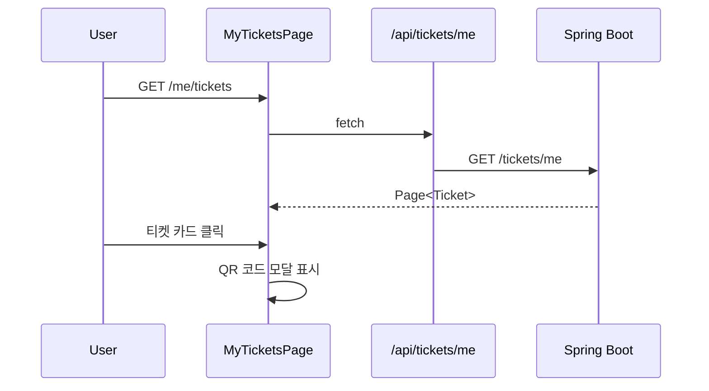
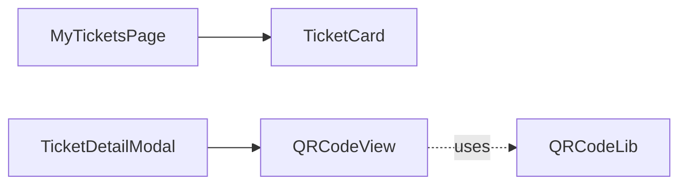

# [WEB-07b] 마이페이지 — 티켓 목록

## 작업 내용 (설계 의도)

### 변경 사항

`app/(authed)/me/tickets/page.tsx` 본인 보유 티켓 목록 + 단건 상세(QR 코드 렌더).

BFF: `GET /api/tickets/me`, `GET /api/tickets/[id]`.

QR 코드는 클라이언트에서 `qrcode.react` 라이브러리로 `ticket.code` 값을 렌더. 캡처 방지를 위한 watermark 오버레이.

REVOKED 티켓은 기본 응답에서 제외, "환불된 티켓" 토글로 보기.

## 다이어그램

### 처리 흐름

### 클래스 의존

## 테스트 케이스

### 단위 테스트 (Unit)
| ID | 대상 | 케이스 |
|---|---|---|
| U-01 | `QRCodeView` | ticket.code 값이 QR로 렌더되고 watermark 오버레이가 표시된다 |
| U-02 | `TicketCard` | REVOKED 상태는 기본 응답에서 숨겨지고 토글 시 노출된다 |
| U-03 | `useMyTickets` | Event 정보(title, venue, startsAt)가 카드에 정확히 표시된다 |

### 레포지토리 테스트 (Repository / Persistence)
| ID | 대상 | 케이스 |
|---|---|---|
| R-01 | — | Repository 없음 |

### 시나리오 테스트 (Scenario / Integration)
| ID | 시나리오 | 케이스 |
|---|---|---|
| S-01 | 본인 티켓 (Playwright) | ISSUED 티켓만 기본 표시되고 다른 사용자 티켓은 노출되지 않는다 |
| S-02 | QR 모달 | 카드 클릭 시 QR 코드가 200ms 내 렌더된다 |
| S-03 | 인가 위반 | 타인 ticketId 직접 라우트 진입 시 403 응답이 반환된다 |
