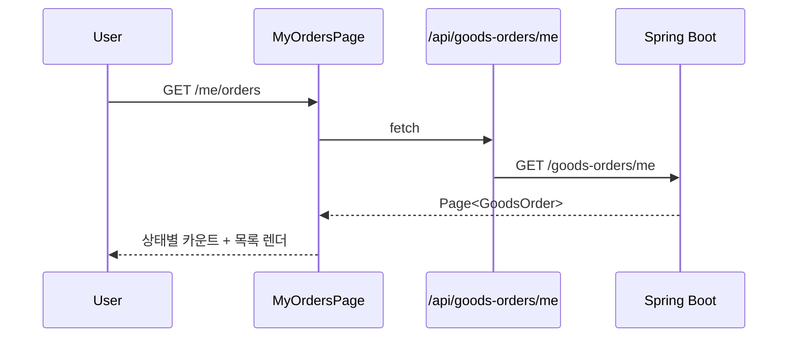
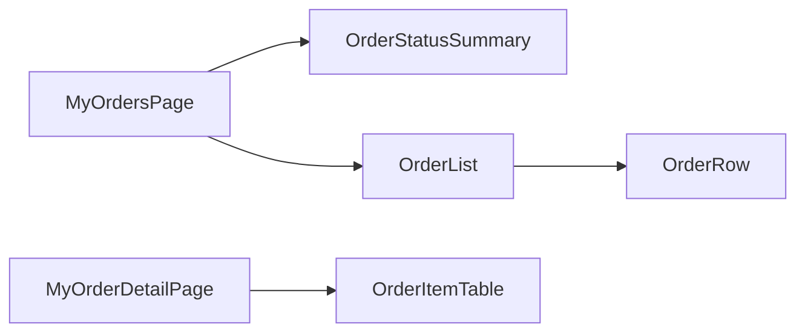

# [WEB-07c] 마이페이지 — 주문 목록

## 작업 내용 (설계 의도)

### 변경 사항

`app/(authed)/me/orders/page.tsx` 본인 GoodsOrder 목록 + 단건 상세(배송 추적은 V2 placeholder).

BFF: `GET /api/goods-orders/me`, `GET /api/goods-orders/[id]`.

상태별 카운트 카드를 상단에 노출(PENDING/CONFIRMED/SHIPPED/DELIVERED/CANCELLED). 단건 상세는 주문 항목 + 결제 정보 + 배송지(V2).

분할 의도: GOODS-05 완료 직후 시작 가능. 다른 도메인 마이페이지와 독립적으로 진행.

## 다이어그램

### 처리 흐름

### 클래스 의존

## 테스트 케이스

### 단위 테스트 (Unit)
| ID | 대상 | 케이스 |
|---|---|---|
| U-01 | `OrderStatusSummary` | 5개 상태 카운트가 각각의 카드에 정확히 표시된다 |
| U-02 | `OrderRow` | CANCELLED 주문은 취소 사유 + 환불 예정 일자가 표시된다 |
| U-03 | `useMyOrders` | 무한 스크롤 끝 도달 시 다음 페이지가 fetch된다 |

### 레포지토리 테스트 (Repository / Persistence)
| ID | 대상 | 케이스 |
|---|---|---|
| R-01 | — | Repository 없음 |

### 시나리오 테스트 (Scenario / Integration)
| ID | 시나리오 | 케이스 |
|---|---|---|
| S-01 | 상태 필터 (Playwright) | 상태 카드 클릭 시 해당 상태 주문만 필터링된다 |
| S-02 | 단건 상세 | 주문 항목(상품명·수량·가격)이 정확히 표시되고 합계가 일치한다 |
| S-03 | 인가 | 타인 orderId 접근 시 403 응답이 반환된다 |
