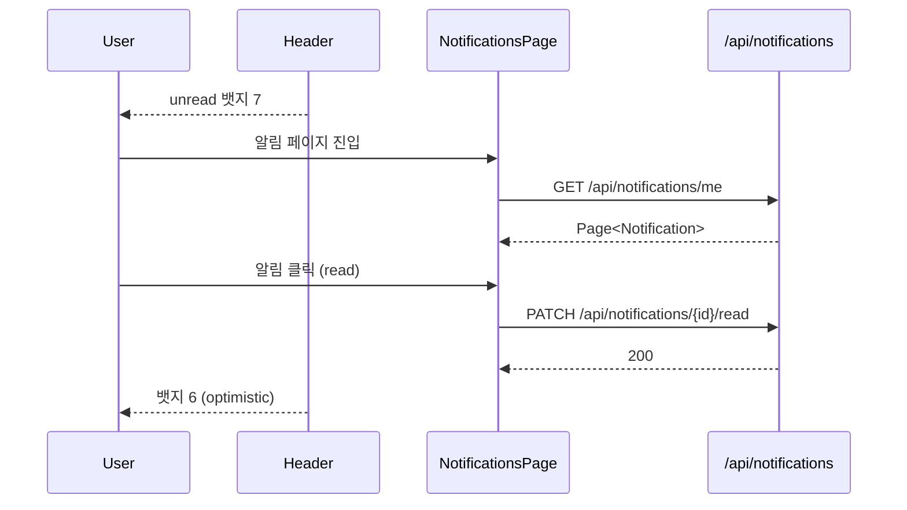
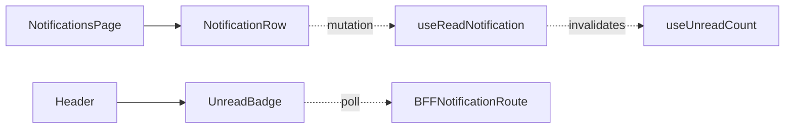

# [WEB-07d] 마이페이지 — 알림 목록 + 헤더 뱃지

## 작업 내용 (설계 의도)

### 변경 사항

`app/(authed)/me/notifications/page.tsx` 본인 알림 목록 + read 처리. 헤더에 미읽음 뱃지 표시 (글로벌 컴포넌트).

BFF:
- `GET /api/notifications/me?status=...`
- `PATCH /api/notifications/[id]/read`
- `GET /api/notifications/me/unread-count`

미읽음 뱃지는 `useUnreadCount` hook이 60초 폴링 + read 액션 시 즉시 -1 갱신. 알림 클릭 시 deep link 라우트로 이동(예: 결제 완료 알림 → `/me/bookings/{id}`).

분할 의도: NOTIFICATION-02 완료 직후 시작 가능. 다른 도메인 마이페이지와 독립.

## 다이어그램

### 처리 흐름

### 클래스 의존

## 테스트 케이스

### 단위 테스트 (Unit)
| ID | 대상 | 케이스 |
|---|---|---|
| U-01 | `useUnreadCount` | 폴링 간격 60초, 백그라운드 시 일시정지 |
| U-02 | `useReadNotification` | 옵티미스틱 mark + 실패 시 rollback |
| U-03 | `NotificationRow` | deep link 매핑 테이블에 따라 도메인별 라우트로 이동한다 |

### 레포지토리 테스트 (Repository / Persistence)
| ID | 대상 | 케이스 |
|---|---|---|
| R-01 | — | Repository 없음 |

### 시나리오 테스트 (Scenario / Integration)
| ID | 시나리오 | 케이스 |
|---|---|---|
| S-01 | 미읽음 뱃지 갱신 (Playwright) | 알림 1건 read 후 헤더 뱃지가 -1 즉시 갱신된다 |
| S-02 | deep link | 결제 완료 알림 클릭 시 `/me/bookings/{id}` 라우트로 이동한다 |
| S-03 | 인가 | 타인 notificationId PATCH 시도 시 403 응답이 반환된다 |
