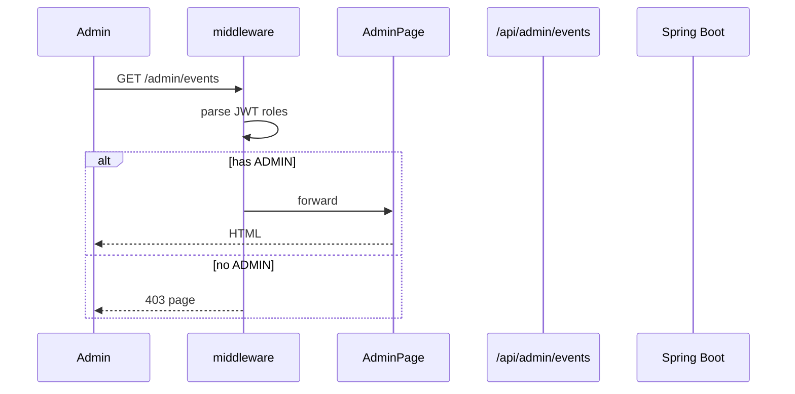
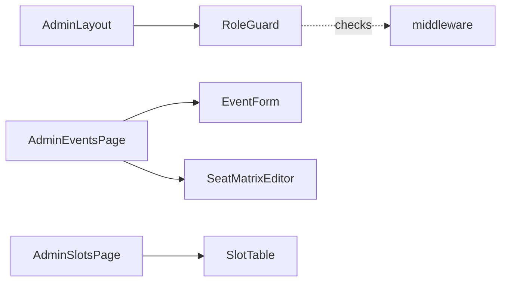

# [WEB-08] 관리자/Owner 어드민 화면

## 작업 내용 (설계 의도)

### 변경 사항

`app/(admin)/admin/...` 라우트 그룹. middleware에서 Role 검증(`ADMIN` 또는 `FACILITY_OWNER`)을 강제. 미인가 접근은 403 페이지로 라우팅.

화면:
- `/admin/users` — 사용자 목록·Role 부여 (ADMIN 전용)
- `/admin/events` — 경기 등록·좌석 일괄 등록 (ADMIN)
- `/admin/products` — 상품 등록 (ADMIN)
- `/admin/slots` — 본인 시설 슬롯 관리 (FACILITY_OWNER)

좌석 일괄 등록은 섹션·열 행렬을 CSV/그리드 입력으로 받음.

## 다이어그램

### 처리 흐름

### 클래스 의존

## 테스트 케이스

### 단위 테스트 (Unit)
| ID | 대상 | 케이스 |
|---|---|---|
| U-01 | `RoleGuard` | 요구 Role이 없는 사용자에 대해 children을 렌더하지 않고 403 컴포넌트를 표시한다 |
| U-02 | `SeatMatrixEditor` | 빈 셀이 포함된 행은 제출 직전 자동 trim되고 0행이면 submit이 disabled된다 |

### 레포지토리 테스트 (Repository / Persistence)
| ID | 대상 | 케이스 |
|---|---|---|
| R-01 | — | 별도 Repository 없음 |

### 시나리오 테스트 (Scenario / Integration)
| ID | 시나리오 | 케이스 |
|---|---|---|
| S-01 | Role 기반 라우팅 (Playwright) | 일반 USER가 `/admin/users` 접근 시 403 페이지로 라우팅된다 |
| S-02 | 이벤트 등록 | ADMIN이 경기와 좌석 100석을 함께 등록 → BE 201 응답 후 목록에 노출된다 |
| S-03 | Owner 슬롯 등록 | FACILITY_OWNER가 본인 시설에 슬롯 등록 시 성공, 타인 시설은 403 응답이다 |
