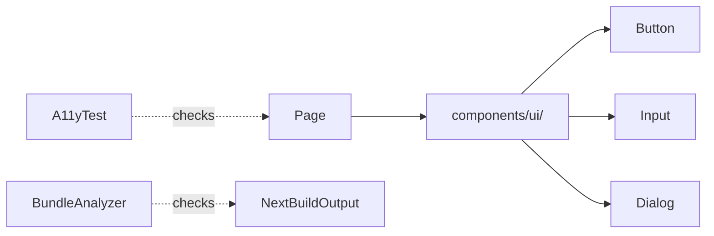

# [WEB-09] 접근성(a11y) + 번들 예산 + 공통 컴포넌트 정리

## 작업 내용 (설계 의도)

### 변경 사항

axe-core를 Playwright 시나리오 테스트에 통합해 주요 페이지의 접근성 위반 0건을 강제. CI에서 PR마다 검증.

번들 분석:
- 초기 진입 JS bundle gzip ≤ 250KB
- 페이지별 lazy chunk 100KB 이하
- 지도 SDK 등 무거운 라이브러리는 dynamic import + ssr:false

shadcn/ui 기반 공통 컴포넌트(Button/Input/Dialog/Toast/Tabs/Badge)를 `components/ui/`에 단일 소스로 두고 페이지에서는 재사용. 직접 Tailwind class 조합 금지 (구성 가능한 variants만 사용).

다크 모드 토글은 V2.

## 다이어그램

### 클래스 의존

## 테스트 케이스

### 단위 테스트 (Unit)
| ID | 대상 | 케이스 |
|---|---|---|
| U-01 | `Button` 컴포넌트 | aria-disabled 속성이 disabled prop과 일치한다 |
| U-02 | `Dialog` 컴포넌트 | ESC 키로 닫기가 동작하고 포커스가 호출 element로 복귀한다 |
| U-03 | `ToastProvider` | 알림 큐 길이가 max(5)를 초과하면 가장 오래된 토스트가 제거된다 |

### 레포지토리 테스트 (Repository / Persistence)
| ID | 대상 | 케이스 |
|---|---|---|
| R-01 | — | 별도 Repository 없음 |

### 시나리오 테스트 (Scenario / Integration)
| ID | 시나리오 | 케이스 |
|---|---|---|
| S-01 | a11y 검증 (Playwright + axe) | 주요 5개 페이지(랜딩, 시설, 경기, 장바구니, 마이) 모두 axe-core 위반 0건이다 |
| S-02 | 번들 예산 | next-bundle-analyzer 결과 initial JS gzip ≤ 250KB로 PR 임계가 통과된다 |
| S-03 | 키보드 네비게이션 | Tab 순서로 모든 인터랙티브 요소가 도달 가능하다 |
